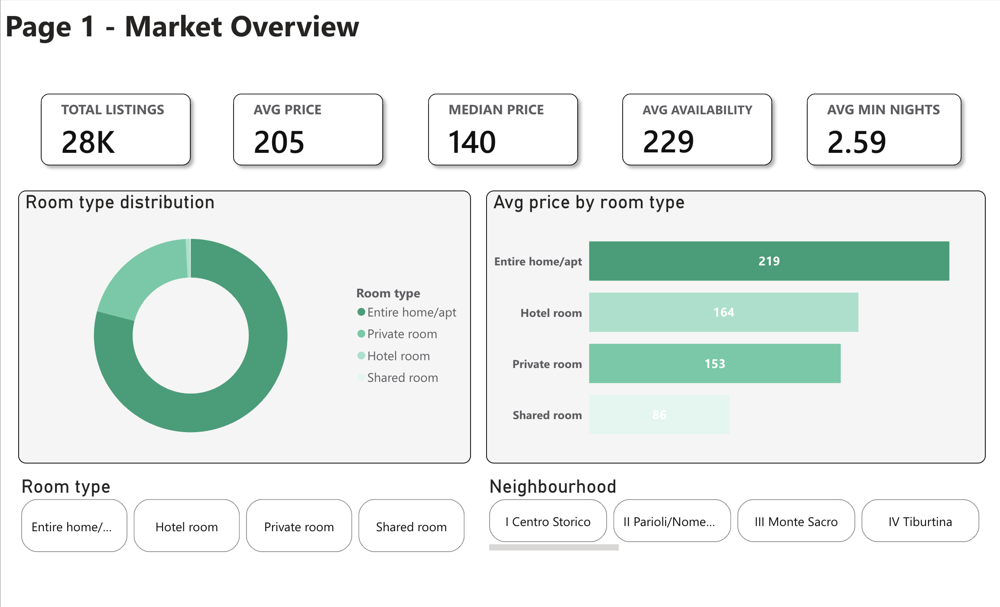
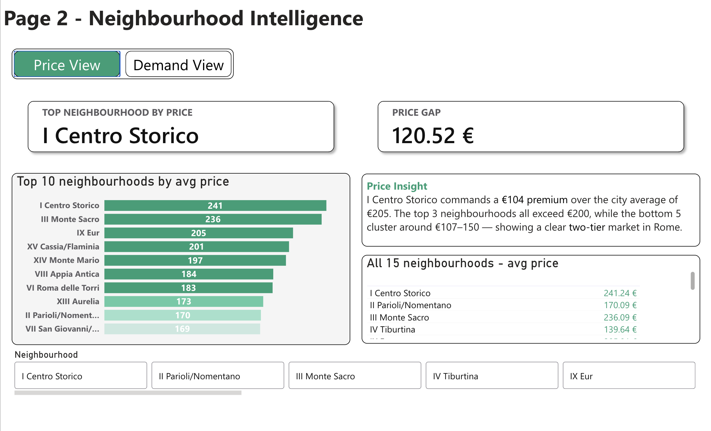
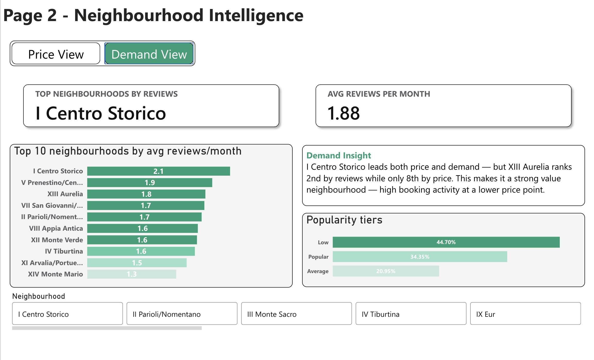
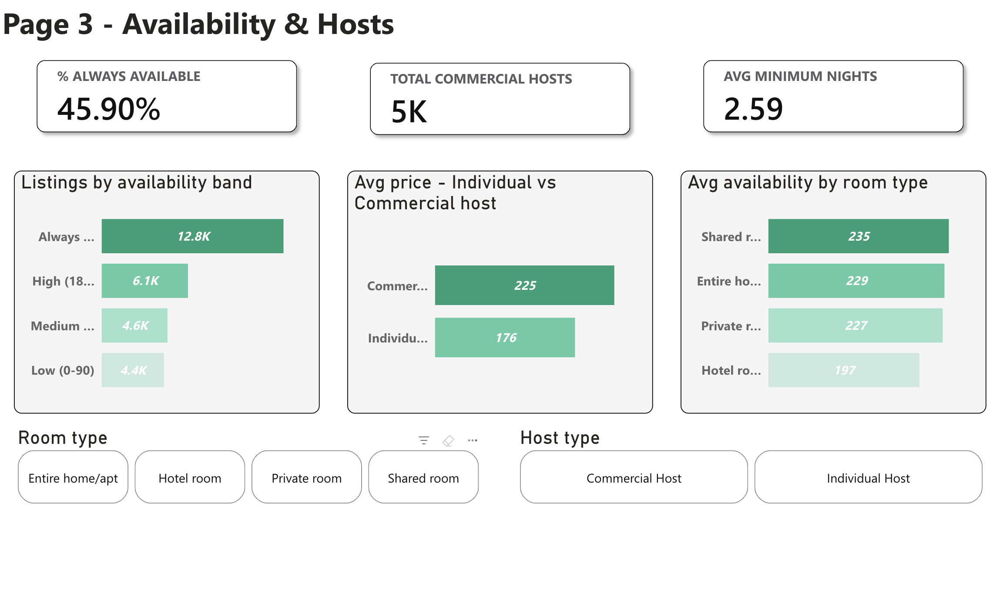
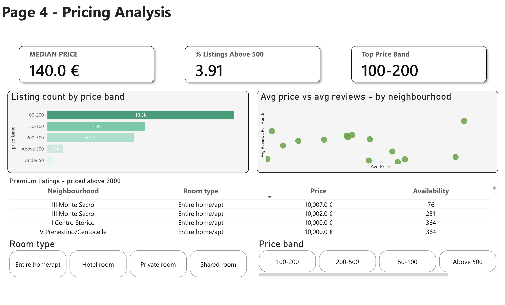

# 🏛️ Rome Airbnb Market Analysis

An end-to-end data analysis project exploring Rome's Airbnb market using **27,909 listings** sourced from Inside Airbnb (September 2025). The project combines SQL-based exploration with an interactive Power BI dashboard to uncover what drives pricing, demand, and host behaviour across Rome's 15 neighbourhoods.

**Central Question:** What drives pricing in Rome's Airbnb market, and how do room type, neighbourhood, availability, and host behaviour shape the market?

📂 **[Download Power BI File (.pbix)](powerbi/airbnb.pbix)** — Open in Power BI Desktop to explore the full interactive dashboard.

---

## 📌 Key Findings

- **28,000+ listings** across 15 neighbourhoods, with an average nightly price of **€205**
- **I Centro Storico** is the most expensive and most in-demand neighbourhood — commanding a **€120 price premium** over the city's cheapest areas
- **Entire home/apt** listings dominate at the highest average price (**€219/night**), nearly 3x shared rooms
- **45.9% of listings** are always available (365 days), suggesting a large portion are managed commercially
- **5,000+ commercial hosts** charge on average **€49 more per night** than individual hosts (€225 vs €176)
- The most popular price band is **€100–200**, covering over 13,000 listings — the sweet spot of Rome's Airbnb market
- Only **3.91% of listings** are priced above €500, with premium listings concentrated in III Monte Sacro and I Centro Storico

---

## 🛠️ Tools Used

| Tool | Purpose |
|---|---|
| **MySQL** | Data exploration, pricing analysis, host behaviour, stored procedure |
| **Power BI** | Interactive 4-page dashboard with DAX measures and bookmark toggles |

---

## 📂 Dataset

| Detail | Info |
|---|---|
| **Source** | [Inside Airbnb](http://insideairbnb.com/get-the-data/) — Rome, Lazio, Italy |
| **Snapshot Date** | September 2025 |
| **Total Listings** | 27,909 |
| **Key Columns** | price, room_type, neighbourhood, availability_365, number_of_reviews, reviews_per_month, calculated_host_listings_count, minimum_nights |


---


## 🗄️ SQL Analysis

The SQL file contains **19 queries across 8 modules**, all written in MySQL.

| Module | Focus |
|---|---|
| Module 1 — Exploration | Total listings, distinct neighbourhoods, null/zero review counts |
| Module 2 — Pricing Overview | Avg/min/max price, price by room type, most expensive and affordable neighbourhoods |
| Module 3 — Room Type Analysis | Listing count and % per room type, highest average availability by room type |
| Module 4 — Host Behaviour | Hosts with 10+ listings, avg price single vs multi-listing hosts |
| Module 5 — Availability & Demand | Avg availability by room type, listings grouped into availability bands |
| Module 6 — Reviews Analysis | Top 10 neighbourhoods by avg reviews/month, popularity classification (Popular/Average/Low) |
| Module 7 — Pricing Outliers | Listings above €500 by room type, avg price with vs without outliers |
| Module 8 — Stored Procedure | Parameterised procedure: input any neighbourhood → returns full KPI summary |

### Stored Procedure Example
```sql
CALL neighbourhood_name('I Centro Storico');
-- Returns: Listings, Avg Price, Avg Availability, Avg Monthly Reviews
```

---

## 📊 Power BI Dashboard

The dashboard consists of **4 interactive pages** built with 10 DAX measures, 3 calculated columns, and bookmark-based toggle navigation.

---

### Page 1 — Market Overview


A high-level snapshot of Rome's Airbnb market with 5 KPI cards and room type breakdown.

- **KPIs:** Total Listings · Avg Price · Median Price · Avg Availability · Avg Min Nights
- **Charts:** Room type distribution (donut) · Avg price by room type (bar)
- **Slicers:** Room type · Neighbourhood

---

### Page 2 — Neighbourhood Intelligence



A dual-view page with a **bookmark toggle** switching between Price and Demand perspectives.

**Price View**
- Top neighbourhood by price: **I Centro Storico (€241)**
- Price gap between highest and lowest: **€120.52**
- Top 10 neighbourhoods by avg price (bar chart)
- All 15 neighbourhoods pricing table

**Demand View**
- Top neighbourhood by reviews: **I Centro Storico**
- Avg reviews per month: **1.88**
- Top 10 neighbourhoods by avg reviews/month
- Popularity tiers: Low (44.7%) · Popular (34.35%) · Average (20.95%)

---

### Page 3 — Availability & Hosts


Explores listing availability patterns and the split between commercial and individual hosts.

- **KPIs:** % Always Available (45.90%) · Total Commercial Hosts (5K) · Avg Min Nights (2.59)
- **Charts:** Listings by availability band · Avg price — Individual vs Commercial hosts · Avg availability by room type
- **Slicers:** Room type · Host type

---

### Page 4 — Pricing Analysis


Deep dive into price distribution, outliers, and the relationship between price and demand.

- **KPIs:** Median Price (€140) · % Listings Above €500 (3.91%) · Top Price Band (€100–200)
- **Charts:** Listing count by price band (bar) · Avg price vs avg reviews by neighbourhood (scatter)
- **Table:** Premium listings priced above €2,000
- **Slicers:** Price band · Room type

---

## 👩‍💻 Author

**Mahak Agarwal**
[GitHub](https://github.com/MahakAgarwal-26) · [LinkedIn](https://www.linkedin.com/in/mahak-agarwal-446858251/)
