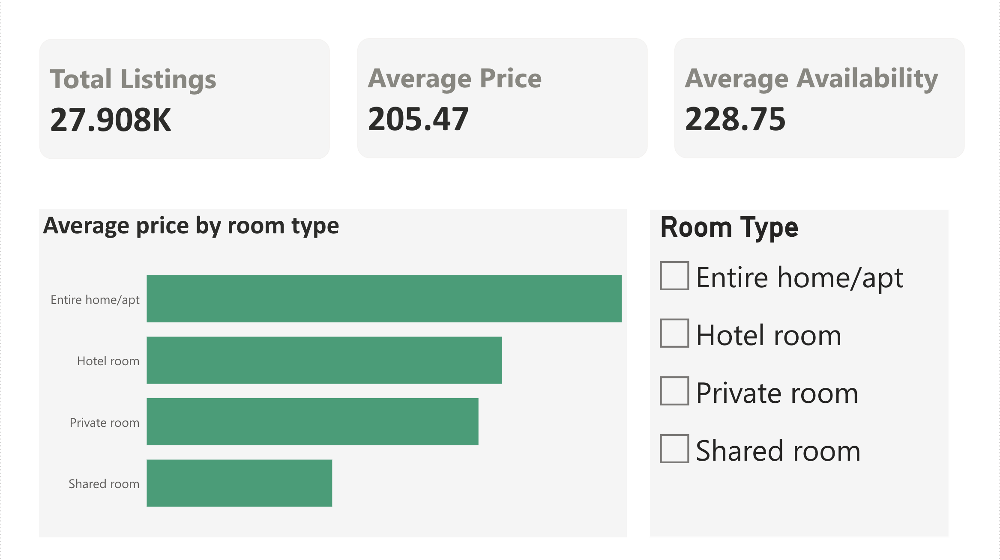

# Rome Airbnb Market Analysis

## Overview
An end-to-end data analysis project exploring what drives Airbnb listing prices in Rome, Italy. The analysis covers 27,909 listings sourced from Inside Airbnb (September 2025) and is built across three tools: SQL, Power BI, and Python.

**Central question:** What factors determine the nightly price of an Airbnb listing in Rome, and which locations and room types offer the best value?

## Tools Used
- **MySQL** — data exploration and analysis
- **Power BI** — interactive dashboard
- **Python** — statistical analysis and visualisation (in progress)

## Dataset
- **Source:** [Inside Airbnb](http://insideairbnb.com/get-the-data/) — Rome, Lazio, Italy (September 2025)
- **Rows:** 27,909 listings after cleaning
- **Key columns:** price, room_type, neighbourhood, availability_365, number_of_reviews, reviews_per_month, calculated_host_listings_count

## Repository Structure
```
Rome-Airbnb-Analysis/
├── data/
│   └── airbnb_data.csv
├── sql/
│   └── rome_airbnb_queries.sql
├── powerbi/screenshots/
└── python/           ← coming soon
```

## SQL Analysis
Eight modules covering exploration, pricing, room types, host behaviour, availability, reviews, and outlier detection. Includes a parameterised stored procedure that returns a full KPI summary for any neighbourhood.

## Power BI Dashboard

### Page 1 — Overview


### Page 2 — Neighbourhood Analysis


### Page 3 — Availability & Hosts


### Page 4 — Pricing Insights


## Author
Mahak Agarwal
